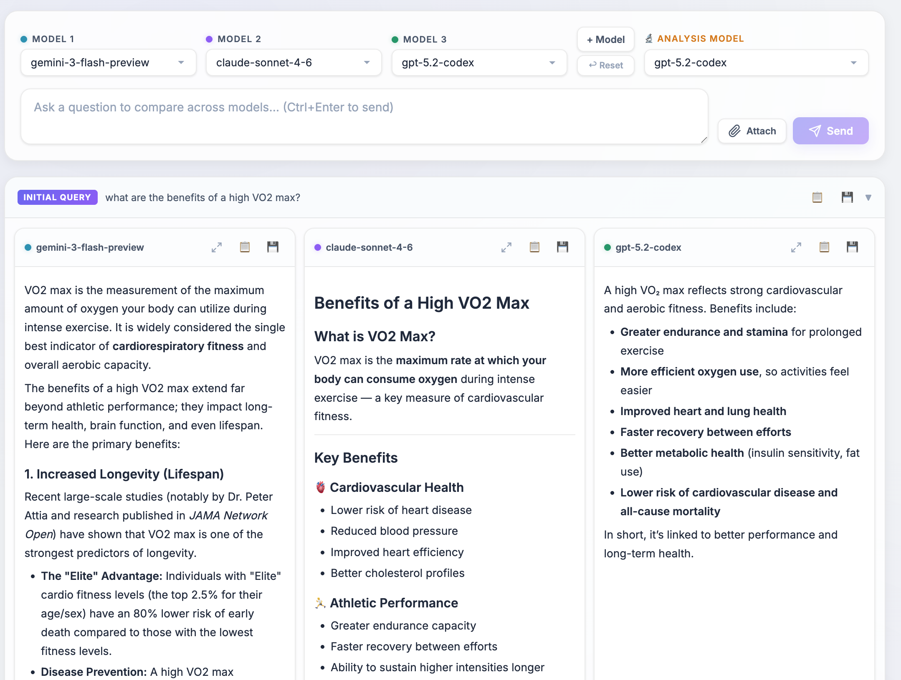

# LLM Compare

A beautiful single-page web app that lets you compare answers from multiple AI language models side-by-side, with an analysis model providing comparative summaries and support for multi-round follow-up conversations.




## Features

### Core
- **Multi-Model Comparison** — Compare any number of LLMs simultaneously (default 3, add or remove as needed)
- **Dynamic Model Columns** — Click **+ Model** to add more columns (4, 5, …unlimited). Remove any column with the ✕ button on its label. Minimum of 1 model required
- **Streaming Responses** — Real-time token-by-token streaming for a smooth, responsive experience
- **Comparative Analysis** — A dedicated analysis model compares all responses, highlighting agreements, differences, and suggesting follow-up questions
- **Follow-up Conversations** — Ask follow-up questions that maintain full conversation history with each LLM. Each follow-up creates a new round below the previous one

### UI & Interaction
- **Markdown Rendering** — All responses rendered as rich markdown (code blocks, tables, lists, headings, etc.)
- **Inline Image Support** — Images in AI responses (markdown `` syntax) render inline with zoom-on-hover and click-to-open in a new tab
- **Collapsible Rounds** — Click any round header to collapse/expand it — great for long conversations
- **Resizable Panels** — Drag the handles between columns to adjust widths
- **Expandable Panels** — Click the expand button on any panel to view it full-width, collapsing the others
- **Token/Credit Usage** — Displays token counts and credit usage for each query
- **Faded "None" Slots** — Model columns set to "— None —" fade out visually to indicate they're inactive

### Save & Export
- **Smart Filenames** — When saving, the app queries the analysis model to generate a natural, descriptive filename based on your initial prompt (e.g., `rome_hotels_john_cabot.md` instead of `llm-comparison-full-report.md`)
- **Per-panel save/copy** — Save or copy an individual model's response
- **Per-round save/copy** — Save or copy a single round (prompt + all responses + analysis)
- **Full conversation save/copy** — Save or copy the entire multi-round conversation as a `.md` report
- **Filename Fallback** — If the AI filename generation times out (10s limit) or fails, a sensible fallback name is used

### Continue on Your Preferred Provider
One of the most useful features: once you compare answers and find the model you like best, you can seamlessly continue the conversation on that model's own website.

- **Re-ask on Provider** — Copies your prompt to the clipboard and opens the model's web UI (ChatGPT, Claude, Gemini, Grok, DeepSeek, or Kimi) so you can paste and re-ask directly
- **Follow up with Context** — Copies both your prompt *and* the model's response, then opens the provider's site — perfect for continuing a deeper conversation with full context

Each response panel shows these buttons at the bottom (e.g., "🤖 Re-ask on ChatGPT" or "📋→🟠 Follow up with context"). This lets you use LLM Compare as your starting point, then seamlessly switch to a specific provider when you've found the answer you want to build on.

### Persistence
- **API Key** — Stored in browser `localStorage`, remembered across sessions
- **Model Configuration** — The number of model columns, selected models, and analysis model are all persisted in `localStorage` and restored on reload
- **Custom Analysis Instructions** — Your customized analysis prompt is saved in `localStorage`
- **Reset to Default** — Click **↩ Reset** to restore the default 3-model configuration at any time

### File Attachments
- **Upload Files** — Attach images, code files, text, CSV, JSON, and more to your prompts
- **Drag & Drop** — Drag files directly onto the prompt area or follow-up inputs
- **Image Previews** — Attached images show thumbnail previews as chips
- **Multimodal Support** — Images are sent as base64 `image_url` parts; text files are included inline in the prompt

## Prerequisites

- A modern web browser (Chrome, Firefox, Safari, Edge)
- An **Abacus AI** account with a RouteLLM API key
  - Sign up at [abacus.ai](https://abacus.ai)
  - Get your API key from the RouteLLM API section in the ChatLLM interface

## Quick Start

1. **Download the files** — Save `index.html`, `app.js`, and `styles.css` to a folder on your computer.

2. **Open it** — Double-click `index.html` to open it in your browser. That's it!

3. **Bookmark it** — If you like it, bookmark the page (⌘D / Ctrl+D) or add it to your browser favorites so it's always one click away.

> **Tip:** Since the app runs entirely in your browser with no server needed, your bookmarked local file will always work — even offline (except for the API calls themselves, of course).

### Alternative: Local HTTP Server

If you run into any issues with your browser blocking API requests from a `file://` URL, you can serve the files locally:

```bash
# Python (comes pre-installed on macOS)
python3 -m http.server 8765

# Or Node.js
npx -y http-server . -p 8765
```

Then open **http://localhost:8765** in your browser.

## Usage

1. **Enter your API Key** — Paste your Abacus AI RouteLLM API key in the header field. It will be remembered for future sessions.

2. **Configure Models** — Choose models from the dropdowns. Set any slot to "— None —" to disable it (the slot will fade out). Use **+ Model** to add more columns or the **✕** button to remove one.

3. **Choose an Analysis Model** — The model that compares responses. Defaults to `gpt-5.2-codex`. Both analysis and column dropdowns share the same full model list.

4. **Customize Analysis (Optional)** — Click **⚙️ Analysis Prompt** to edit the system prompt used by the analysis LLM. You can revert to defaults at any time.

5. **Attach Files (Optional)** — Click **Attach** or drag files onto the prompt area. Supported: images, code files, text, CSV, JSON, XML, YAML, PDF, and more.

6. **Ask your question** — Type in the prompt box and click **Send** (or press `Ctrl+Enter` / `Cmd+Enter`).

7. **Review results** — Watch responses stream in real-time across the columns. Once all models respond, the analysis automatically runs.

8. **Ask follow-ups** — Use the follow-up input at the bottom of any round. Each LLM receives the full conversation history (but not the analysis). A new round appears below.

9. **Collapse old rounds** — Click the round header (e.g., "Initial Query" or "Follow-up #1") to collapse/expand it.

10. **Save/Export** — Use the 📋 and 💾 buttons at various levels:
    - On each panel → save/copy that model's response
    - On each round header → save/copy the entire round
    - At the bottom → **Save/Copy Entire Conversation** for a full report
    - Filenames are auto-generated based on your question (e.g., `rome_hotels_john_cabot.md`)

11. **Reset Models** — Click **↩ Reset** to restore the default 3-model configuration.

## Available Models

Models are organized by provider:

| Provider | Models |
|----------|--------|
| **Routing** | route-llm |
| **OpenAI** | gpt-5.2-codex, gpt-4o, gpt-4o-mini, gpt-4-turbo, gpt-4, gpt-3.5-turbo |
| **Anthropic** | claude-sonnet-4-6, claude-opus-4-6, claude-sonnet-4-5, claude-opus-4-5, claude-haiku-4-5, and more |
| **Google** | gemini-3.1-pro-preview, gemini-3-pro-preview, gemini-3-flash-preview, gemini-2.5-pro, gemini-2.5-flash |
| **xAI** | grok-4-0709, grok-4-1-fast, grok-4-fast, grok-code-fast-1 |
| **Meta** | Llama-4-Maverick, Llama-3.1-405B-Turbo, Llama-3.1-8B, llama-3.3-70b |
| **Qwen** | qwen3-coder-480b, qwen3-max, Qwen3-235B, Qwen3-32B, QwQ-32B, and more |
| **DeepSeek** | DeepSeek-V3.2, deepseek-v3.1, deepseek-R1 |
| **Kimi** | kimi-k2.5, kimi-k2-turbo-preview |
| **ZhipuAI** | glm-5, glm-4.7, glm-4.6, glm-4.5 |
| **Other** | gpt-oss-120b |

## Project Structure

```
compare-llm-answers/
├── index.html      # Main HTML page
├── styles.css      # All styling (light theme, responsive)
├── app.js          # Application logic (rounds, API, streaming, UI)
├── README.md       # This file
└── requirements.md # Original feature requirements
```

## API Reference

This app uses the [Abacus AI RouteLLM API](https://abacus.ai/help/developer-platform/route-llm/api), which provides an OpenAI-compatible endpoint:

- **Base URL:** `https://routellm.abacus.ai/v1`
- **Endpoint:** `POST /chat/completions`
- **Auth:** `Authorization: Bearer <your_api_key>`
- **Streaming:** SSE via `stream: true`

## License

For personal use.
